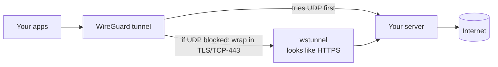

# escape

**A self-hosted, zero-config VPN with a censorship-resistant transport layer.**

One command installs it on **Linux, macOS, or Windows**. The device registers itself automatically, then tunnels all traffic through *your own* server — transparently falling back from fast **WireGuard-over-UDP** to a **TLS-disguised TCP-443** tunnel on networks that block VPNs (deep-packet-inspection, UDP blocks, captive filters).

No accounts. No config files. No per-user setup. Just `escape_start`.

---

## ✨ Features

- **One-command install** on every desktop OS — plus native package managers (AUR / Homebrew / Scoop)
- **Zero-config enrollment** — a new device generates its own keys and registers itself with the server on first run
- **Automatic transport selection** — tries WireGuard/UDP for speed, and if the network blocks it, silently switches to a TCP-443 tunnel that looks like ordinary HTTPS
- **Self-hosted** — your own server, your own clean IP (never mass-blocked like public VPNs)
- **Fail-safe** — if a tunnel can't be established, it rolls back automatically; your connection is never left stranded

## 🚀 Install

| OS | One-liner | Package manager |
|----|-----------|-----------------|
| **Linux** | `curl -fsSL https://d-deadric-c.github.io/escape/linux \| sudo bash` | `yay -S escape` |
| **macOS** | `curl -fsSL https://d-deadric-c.github.io/escape/mac \| sudo bash` | `brew install d-deadric-c/escape/escape` |
| **Windows** *(Admin PowerShell)* | `irm https://d-deadric-c.github.io/escape/win \| iex` | `scoop bucket add escape https://github.com/D-Deadric-C/escape && scoop install escape` |

Each installer pulls its dependencies (WireGuard + the transport engine) automatically and connects — nothing else to do.

## 🎮 Usage

```bash
escape_start      # connect  (registers the device on first run)
escape_status     # is it up? shows your current public IP
escape_stop       # disconnect
```

## 🧠 How it works



1. **Tunnel** — WireGuard encrypts every packet and sends it to your server, which fetches the internet on your behalf. The network only ever sees one encrypted stream to a single IP.
2. **Transport fallback** — restrictive networks often block UDP but must allow TCP-443 (HTTPS). When UDP fails, `escape` wraps the WireGuard traffic inside a TLS WebSocket on port 443 (via [`wstunnel`](https://github.com/erebe/wstunnel)) — indistinguishable from normal web browsing.
3. **Enrollment** — on first run the client generates a keypair locally (the private key never leaves the device), registers its public key with the server *over the tunnel*, and receives its own address. Zero manual config.

## 🛠️ Tech stack

**WireGuard** · **wstunnel** (TLS/TCP obfuscation) · **Bash** & **PowerShell** clients · **Python** enrollment service · **systemd** · deployed on a cloud VM · distributed via **GitHub Pages** + AUR / Homebrew / Scoop.

## 🖥️ Server

The server side (WireGuard + wstunnel + a small enrollment API, all as `systemd` services) is set up once with the scripts in [`server/`](server/). See [`docs/`](docs/) for the walkthrough.

## 🔒 Notes

- All traffic is end-to-end encrypted (WireGuard); the server only relays.
- This routes your traffic through infrastructure **you** control — treat it like any VPN.
- Using a VPN may be against some networks' acceptable-use policies. Whether and where to use it is your responsibility; this project only provides the technology.

## 📄 License

MIT
